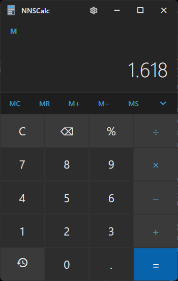
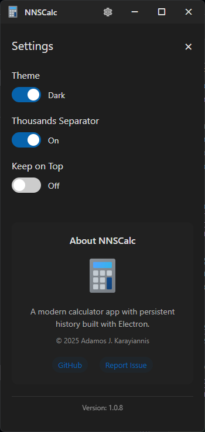
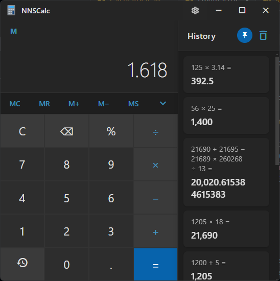
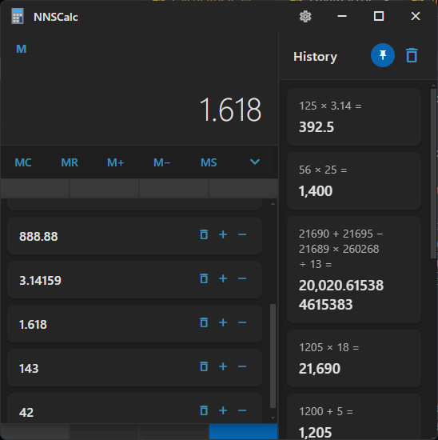
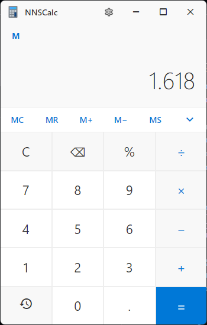
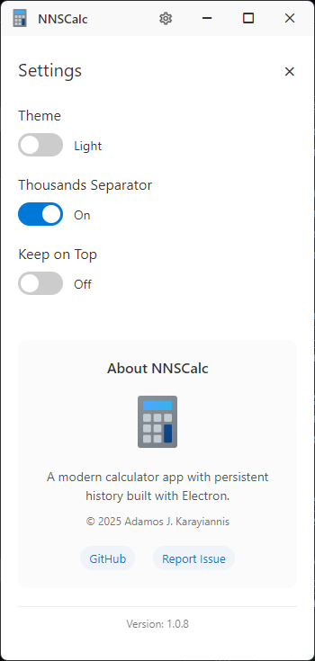
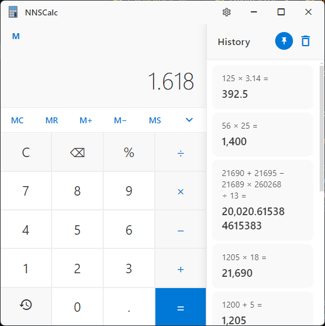
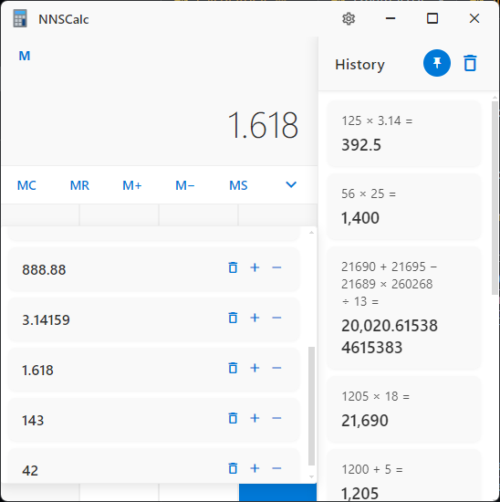

# NNSCalc - Calculator with History & Memory

A modern, sleek calculator application built with Electron, designed to enhance your desktop computing experience.

## Features

- **Persistent Calculation History**: Never lose track of your previous calculations
- **Enhanced Memory Functions**: Store, recall, add to, and subtract from memory with ease
- **Multiple Memory Slots**: Save multiple values for quick access
- **Clean Modern Interface**: Beautiful, intuitive design with light and dark themes
- **Customization Options**: Adjust settings to your preferences
- **Keyboard Shortcuts**: Work efficiently with full keyboard support
- **Always-on-Top Mode**: Keep calculator visible while working in other applications
- **Windows Store Verified**: Trusted, secure application from the Microsoft Store

## Download

NNSCalc is available on the Microsoft Store. Get it now for the best experience!

## Screenshots

### Dark Theme

### Light Theme

## Support

If you encounter any issues or have suggestions, please file an issue on this repository.

## License

MIT License